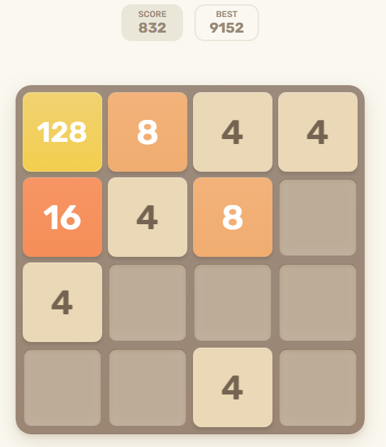

# Deep Reinforcement Learning for 2048

Deep Reinforcement Learning (Deep RL) using the PPO algorithm to play the 2048 game. 


## Game Overview

2048 is a grid-based puzzle game where you have a 4x4 board and must use arrow keys to move all the tiles a certain direction. You must merge tiles of the same number to combine into tiles of double the value. The aim of the game is to reach a 2048 tile, although the game will only end when you no longer have any valid moves. 



## Approach

Initially, I tried using the REINFORCE algorithm. However I quickly began to realise the complexity of 2048 due to its large state space. I then transitioned to the PPO algorithm, which is an on-policy method where the agent plays hundreds of thousands of games and updates a neural network to maximise rewards. 

A key defining feature of PPO is the clipped surrogate objective function, which stabilises training and reduces variance by limiting policy update changes at each episode. An actor-critic neural network architecture is used, where the actor trains a policy in charge of sampling and taking actions. The critic then evaluates each state and returns a value indicating the quality of the board state. 


## Reward Shaping

In a game of 2048, the player receives an increment to their score equal to the value of every new merged tile created, which exponentially grows the score out of proportion. Therefore, this Deep RL implementation uses the log of the score alongside the following extra rewards and penalties for improved training:


| Variable        | Reward/Penalty            | Details                                                                                                                                                 |
|-----------------|---------------------------|---------------------------------------------------------------------------------------------------------------------------------------------------------|
| move_penalty    | -2                        | Apply a -2 penalty to every move made. <br>Encourages the agent to make the most of each move.                                                          |
| empty_bonus     | -(game.empty_tiles * 0.1) | game.empty_tiles represents the number of empty tiles in the board at each action. <br>Penalises the agent for having many occupied tiles in the board. |
| corner_bonus    | 1                         | Rewards the agent for keeping the largest tile in a corner.                                                                                             |
| milestone_bonus | 1                         | Rewards the agent for reaching tile milestones (128, 256, 512, 1024, 2048)                                                                              |


## Results and Next Steps

After training for 500k episodes, the agent was able to consistently reach scores of around 3000 and frequently achieved a max tile of 256. Although it has occasionally reached the 2048 tile during training, further improvements to the neural network architecture and reward shaping are required to consistently beat the game.

## Files

- ```ppo_2048_game.ipynb``` contains the training code and game logic.
- ```ppo_2048.pt``` contains the saved neural network weights.

